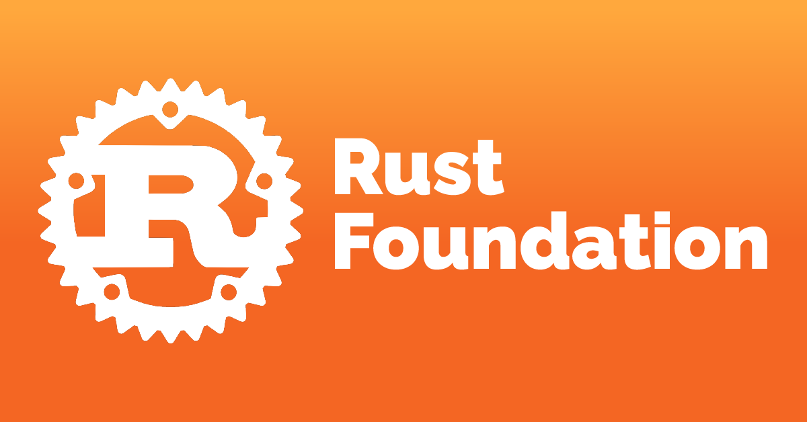

# Historia

- Rust comenzó en **2006** como un proyecto paralelo de [Graydon Hoare](https://github.com/graydon), un empleado de Mozilla.
- En poco tiempo, Mozilla vio el potencial del nuevo lenguaje y comenzó a patrocinarlo en **2009**, antes de revelarlo al mundo en **2010**.
- La primera versión estable de Rust fue lanzada el 15 de mayo de **2015**.
- En agosto de **2020**, Mozilla despidió 250 empleados para reestructurar internamente la compañia a causa de la pandemia del Covid-19. Entre ellos, el equipo [Servo](https://en.wikipedia.org/wiki/Servo_(software)) (un motor de renderizado web escrito en Rust). Esto creó preocupación sobre el futuro de Rust, pues varios de estos empleados contribuian activamente al lenguaje. 
- La siguiente semana, el equipo desarollador central de Rust confirmó el impacto que habían causado los despidos al lenguaje, tomando la deicisión de entregar los dominios y la propiedad completa del mismo a la fundación Rust 
- El 8 de Febrero de 2021 se anunció la creación formal de la [fundación Rust](https://en.wikipedia.org/wiki/Rust_Foundation) conformada por AWS, Huawei, Google, Microsoft y Mozilla

- En abril del 2021, Google anunció la compatibilidad con Rust dentro del [proyecto de código abierto de Android](https://en.wikipedia.org/wiki/Android_Open_Source_Project), como alternativa a C/C++

## Origen del nombre
Una posible fuente del nombre, según Hoare, es el hongo [Rust](https://en.wikipedia.org/wiki/Rust_(fungus)), o en español hongo roya. En varias ocaciones Graydon ha sido cuestionado por el origen de este nombre, quien siempre [responde](https://www.reddit.com/r/rust/comments/27jvdt/internet_archaeology_the_definitive_endall_source/) que aunque pueden ser varias las razones que lo llevaron a nombrar el lenguaje de programación de esta manera, la 
principal es que los hongos Rust son sorprendemente **robustos**, son organismos **distribuidos** y pueden alternar entre diferentes anfitriones, como si funcionaran en **paralelo**.    

## Aceptación
A pesar de su relativa juventud, Rust ha ascendido constantemente en las filas de los lenguajes de programación populares. De hecho, mientras ocupaba el puesto 33 en julio de 2019, en julio de 2020 había subido al puesto 18 en el Índice de la comunidad de programación de [TIOBE](https://www.tiobe.com/tiobe-index/). Del mismo modo, según la Encuesta de [desarrolladores de Stack Overflow](https://insights.stackoverflow.com/survey/2020#technology-most-loved-dreaded-and-wanted-languages-loved) , Rust ha sido el lenguaje "más querido" cada año desde 2016 hasta 2022.