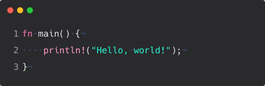

# Introducción

En este capítulo, discutiremos:

- [Instalación de Rust en Linux, macOS y Windows](./introduccion/instalacion.md)

- [Escribir un programa que imprima ¡Hola, mundo!](./introduccion/hola_mundo.md)

- [Usando cargo, el administrador de paquetes de Rust y el sistema de compilación](./introduccion/hola_cargo.md)
