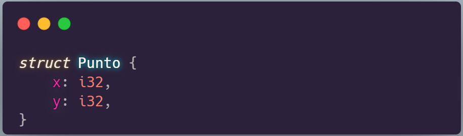

# Estructuras

Un struct, o estructura, es un tipo de datos personalizado que permite empaquetar y nombrar múltiples valores relacionados que conforman un grupo significativo. Si estás familiarizado con un lenguaje orientado a objetos, una estructura es como los atributos de datos de un objeto. 

Es un objeto que carece de métodos.

# Definición de una estructura

Usamos la palabra clave **struct** seguido de un nombre para la estructura, debe ser un nombre descriptivo que defina perfectamente los que a almacenar. Después entre llaves, se definirán los nombres y tipos de los datos que la conformarán que serán lo que llamamos campos.  


```rust
struct User {
    active: bool,
    username: String,
    email: String,
    sign_in_count: u64,
}
```

```rust
#struct User {
#    active: bool,
#    username: String,
#    email: String,
#    sign_in_count: u64,
#}
let primer_usuario = User {
    username: String::from("bdleons"),
    email: String::from("bdleons@gmail.com"),
    active: true,
    sign_in_count: 1,
};

println!("Nombre de Usuario: {}", primer_usuario.username);
println!("Email de Usuario: {}", primer_usuario.email);
println!("Usuario activo?: {}", primer_usuario.active);
println!("Count: {}", primer_usuario.sign_in_count);

```

Si una instancia es mutable, toda la estructura sera mutable

```rust
# struct User {
#    active: bool,
#    username: String,
#    email: String,
#    sign_in_count: u64,
#}
let mut segundo_usuario = User {
    username: String::from("elpepe"),
    email: String::from("alejandro007@gmail.com"),
    active: true,
    sign_in_count: 1,
};

println!("Nombre de Usuario: {}", segundo_usuario.username);
println!("Email de Usuario: {}", segundo_usuario.email);
println!("Usuario activo?: {}", segundo_usuario.active);
println!("Count: {}", segundo_usuario.sign_in_count);

println!("");
segundo_usuario.username = String::from("alejadroS");
segundo_usuario.email = String::from("alejadroSoler@hotmail.com");
segundo_usuario.active = false;
segundo_usuario.sign_in_count = 2;

println!("Nombre de Usuario: {}", segundo_usuario.username);
println!("Email de Usuario: {}", segundo_usuario.email);
println!("Usuario activo?: {}", segundo_usuario.active);
println!("Count: {}", segundo_usuario.sign_in_count);
```

Las funciones pueden retornar estructuras.
```rust
# struct User {
#    active: bool,
#    username: String,
#    email: String,
#    sign_in_count: u64,
#}
fn nuevo_usuario(username: String, email: String) -> User {
    User {
        username: username,
        email: email,
        active: true,
        sign_in_count: 0,
    }
}

let tercer_usuario = nuevo_usuario(String::from("chpetilotag"),String::from("petilota_mail@gmail.com"));
println!("Nombre de Usuario: {}", tercer_usuario.username);
println!("Email de Usuario: {}", tercer_usuario.email);
println!("Usuario activo?: {}", tercer_usuario.active);
println!("Count: {}", tercer_usuario.sign_in_count);
```

Podemos tomar información contenida en estructuras ya instanciadas para usarla en la instanciación de nuevas.

```rust
# struct User {
#    active: bool,
#    username: String,
#    email: String,
#    sign_in_count: u64,
#}
#let primer_usuario = User {
#    username: String::from("bdleons"),
#    email: String::from("bdleons@gmail.com"),
#    active: true,
#    sign_in_count: 1,
#};
let mut cuarto_usuario = User {
    username: String::from("otronombre"),
    email: String::from("otronombre@gmail.com"),
    active: primer_usuario.active,
    sign_in_count: primer_usuario.sign_in_count,
};
println!("Nombre de Usuario: {}", cuarto_usuario.username);
println!("Email de Usuario: {}", cuarto_usuario.email);
println!("Usuario activo?: {}", cuarto_usuario.active);
println!("Count: {}", cuarto_usuario.sign_in_count);
```
Rust nos da una abreviatura para facilitar esto.

```rust
# struct User {
#    active: bool,
#    username: String,
#    email: String,
#    sign_in_count: u64,
#}
#let mut segundo_usuario = User {
#    username: String::from("elpepe"),
#    email: String::from("alejandro007@gmail.com"),
#    active: true,
#    sign_in_count: 1,
#};
#segundo_usuario.username = String::from("alejadroS");
#segundo_usuario.email = String::from("alejadroSoler@hotmail.com");
#segundo_usuario.active = false;
#segundo_usuario.sign_in_count = 2;
let mut quinto_usuario = User {
    username: String::from("anonimo"),
    email: String::from("anonimous007@gmail.com"),
    ..segundo_usuario
};
println!("Nombre de Usuario: {}", quinto_usuario.username);
println!("Email de Usuario: {}", quinto_usuario.email);
println!("Usuario activo?: {}", quinto_usuario.active);
println!("Count: {}", quinto_usuario.sign_in_count);
```